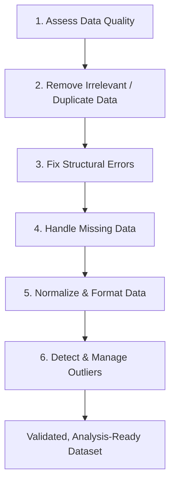

<link rel="stylesheet" href="/assets/css/custom.css">

Imagine a Michelin-star chef handed a basket of half-rotten vegetables, mislabeld spice jars, and a scale that's off by 200 grams. No amount of culinary genius saves that dish. Machine learning models are exactlythe same: a state-of-the-art architecture fed on **dirty data** will confidently produce polished, professional-looking garbage. This is the well-known **"Garbage In, Garbage Out""** (GIGO) principle, and it's why, in most real-world analytics and ML projects, the *unglamorous* work ofdata cleaning quietly eats up more time than the modeling itself.

This posts breaks down data cleaning from first principles - not just "which pandas method do I call," but *what is actually happening to the numbers* when you deduplicate, impute, or flag an outlier. We'll build a complete mental model, then drop down to raw C to watch the mechanics execute one CPU cycle at a time - no `df.dropna()` magic wand, just pointers, sums, and comparisons.

## 1. Why "Garbage In, Garbage Out" Should Terrify You

**Data cleaning** is the process of detecting and correcting (or removing) corrupt, inaccurate, or irrelevant records from a dataset so that it can be trusted for analysis, statistics, or model training. It sits at the very front of the data pipeline, before **Exploratory Data Analysis (EDA)** and long before any model sees in a single row.

Raw data collected from forms, sensors, logs, or third-party APIS is almost never analysis-ready. It's noisy, incomplete, and inconsistent - and every one of those flaws propagates downstream. A single unhandled outlier can drag a regression line off coures; a handful of duplicate rows can make a rare event look common; a silently miscoded "N/A" string can crash an entire aggregation. Clean data isn's a nice-to-have - it's the foundation everything else stands on.

## 2. The Usual Suspects: A Field Guide to Dirty Data

Before we can fix a dataset, we need to know what we're hunting for. Most real-world data quality problems fall into one of six recurring categories: 

| Issue                               | What It Looks Like                   | Why It's Dangerous                                    |
| ----------------------------------- | ------------------------------------ | ----------------------------------------------------- |
| **Missing values**                  | Blank cells, `NULL`, `NaN`           | Reduces statistical power, introduces bias            |
| **Duplicate records**               | The same customer logged twice       | Overrepresents observations, skews aggregates         |
| **Incorrect data types**            | `"25"` (text) instead of `25` (int)  | Breaks calculations, causes silent type-coercion bugs |
| **Outliers / anomalies**            | An age of `200`                      | Distorts means, variances, and model weights          |
| **Inconsistent formats**            | `2026-07-24` vs `07/24/2026`         | Breaks joins, sorting, and date arithmetic            |
| **Typos / inconsistent categories** | `"Vietnam"` vs `"vietnam"` vs `"VN"` | Fragments what should be one category into several    |

## 3. The Data Cleaning Pipeline

Data cleaning isn't a single action - it's a pipeline. Here's the sequence that most practitioners (and the workflow this post follows) converge on:

### Step 1 - Assess Data Quality

Before touching anythin, profile the dataset: how many nulls per collumn, what data types are actually stored, how many unique values exists in each categorical field. This reconnaissnce step tells you *which* of the next five stes actually apply to your data - there's no point building an elaborate outlier pipeline for a column that turns out to be 40% missing.

### Step 2 - Remove Irrelevant & Duplicate Data

Duplicate rows are usually caused by repeated form submissions, merge errors, or logging retries. The classc detection techniques are **sorting**, **grouping**, or **hashing** - and hashing is th one we'll implement in C++ shortly, since it gets us $O(1)$ average-case lookups instead of an $O(n²)$ pairwise comparison. This step also covers dropping columns that are irrelevant to the analysis at hand (an internal `debug_flag` column has no business being in a customer churn model).

### Step 3 - Fix Structural Errors

This is where you standardize formats: making every date `YYYY-MM-DD`, every currency the same unit, every column name `snake_case` instead of a mix f `camelCase` and `Title Case`. It's tedious, but it's what makes joins and groupbys behave predictably later.

### Step 4 - Handle Missing Data

You have three broad options, in increasing order of sophistication:

1. **Deletion** - drop the row (or column) if missing data is extensive and unrecoverable.
2. **Simple imputation** - fill gaps with the **mean**, **median**, or **mode** of the column. Fast, but it quietly shrinks variance.
3. **Model-based imputation** - predict the missing value using **k-Nearest Neighbors**, regression, or a decision tree trained on the other features. More accurate, more expensive.

### Step 5 - Normalize & Format Data

Once the values are completed and correctly typed, they often need to be put on a common scale so no single feature dominates a distance-based algorithm just because it happen to be measured in bigger numbers.

**Min-Max Scaling** compresses every value into a fixed range, typically $[0,1]$:

$$X' = \frac{X - X_{min}}{X_{max} - X_{min}}$$

**Standardization (Z-score scaling)** re-centers the data around a mean of 0 with a standard deviation of 1 - the right choice for algorithms that assume roughly Gaussian-distributed features:

$$Z = \frac{X - \mu}{\sigma}$$

### Step 6 - Detect & Manage Outliers

This is the step with the most nuance, and it's worth slowing down for.

