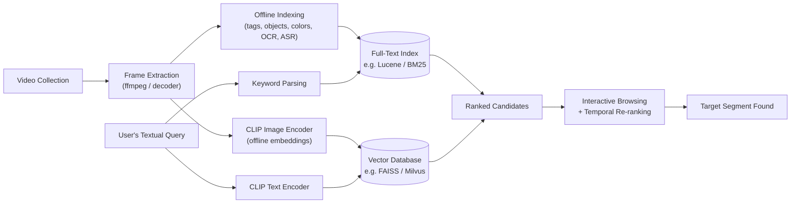

<link rel="stylesheet" href="/assets/css/custom.css">

Imagine you watched a video months ago - maybe a lecture, a news clip, or a random moment from your own life-logging camera - and now you desperately want to find it again. You don't have the filename. You don't have a thumbnail. All you have is a memory, which you can only turn into a sentence: *"A man in a red jacket walks past a fountain while it starts raining, and then a dog runs into the frame."*

Could a search engine find that exact fifteen-second clip, buried inside thousands of hours of footage, using nothing but that sentence?

This is not a hypothetical. It's a real, actively researched problem in multimedia information retrieval called **Textual Known-Item Search (Textual KIS)**, and it sits at the intersection of two fields I find endlessly fascinating: classic information retrieval theory and modern multimodal AI (think CLIP-style models). In this post, we'll unpack what Textual KIS actually means, why it's surprisingly hard, and how state-of-the-art systems solve it - with enough detail that you could start experimenting with a toy version yourself.

## 1. What is KIS?

Before we add the word "textual", let's ground ourselves in the older, broader concept: **Known-Item Search (KIS)**.

The term comes from library science, popularized by researchers like Wildemuth and O'Neill in the 1990s and later refined by Lee, Renear, and Smith (2006). Its definition is deceptively simple:

> A known-item search is one where the searcher already has a *specific* item in mind - they just don't have its exact address yet.

This is fundamentally different from two other kinds of search you're probably more used to thinking about:

* **Exploratory search** - you don't known exactly what you're looking for; you're browsing, learning, or forming a query as you go (e.g., "What are the best noise-cancelling headphones under $200?").
* **Ad-hoc / instance search** - you're not looking for *one* specific item, but for *any and all* items that satisfy a general description (e.g., "Find every video clip that shows a person riding a bicycle.").

Known-item search, by constrast, has one correct answer. It's the digital equivalent of knowing exactly which book you want at the library, but only being able to describe it to the librarian rather than pointing at it. That distinction - *one target, described indirectly* - is the whole game.

## 2. From Library Catalogs to Video Archives

Known-item search stayed a fairly academic, catalog-oriented idea until massive video archives forced the multimedia retrieval community to confront it head-on. We can't "Ctrl+F" a video the way we can a text document - a video is just a wall of pixels and audio samples until something turns it into searchable meaning.

This challenge is formalized every year at the **Video Browser Showdown (VBS)**, an international competition held since 2012 at the International retrieval systems and race the clock to find target segments inside huge, unlabeld video collections. A closely related event, the **Lifelog Search Challenge (LSC)**, applies the same idea to personal lifelog data (photos and video captured continuously from wearable cameras).

VBS defines several task types, and this is where Texttual KIS gets its precise, competitive definition:

| Task                                | What the searcher is given                                                    | Goal                                                                                   | Typical example                                                                                        |
| ----------------------------------- | ----------------------------------------------------------------------------- | -------------------------------------------------------------------------------------- | ------------------------------------------------------------------------------------------------------ |
| **Visual KIS (KIS-V)**              | A short video clip is *shown* to the searcher                                 | Find that exact segment in the full collection                                         | Watch a 20-second clip, then locate it among 1000+ hours of video                                      |
| **Textual KIS (KIS-T)**             | Only a *written description* of the target segment — no visual preview at all | Find that exact, single segment described in words                                     | *"A chef flips a pancake in a pan, the camera then cuts to a plate being garnished with mint leaves."* |
| **KIS-C (progressive/interactive)** | A short, deliberately vague text hint at first                                | Ask clarifying questions; more details are revealed over time (e.g., after 60 seconds) | Starts with "a red car" and later reveals "...parked outside a bakery at night"                        |
| **Ad-hoc Video Search (AVS)**       | A general textual description covering *many* possible shots                  | Find as many correct, diverse instances as possible                                    | *"Find all shots of a person riding a bicycle near trees"*                                             |

Textual KIS is the purest, hardest version of the problem: there's exactly one correct video segment, the searcher never sees it beforehand, and the only bridge between the searcher's mind and the target is natural language. Competitions typically give teams around five minutes per query, with points awarded for speed and correctness and penalties for wrong submissions - which mirrors the real-world stakes of, say, a journalist needing to verify footage under deadline pressure, or an investigator combing through surveillance archives.

## 3. Why Textual KIS is Genuinely Hard

Three problem stack on top of each other:

1. **The semantic gap.** Words and pixels are fundamentally different representations. "A man in a red jacket" is an abstract concept to a computer; a video frame is a grid of RGB numbers. Something has to translate betwween these two worlds.
2. **Scale.** VBS-style datasets can contain thousands of hours of footage - millions of frames. Brute-force comparison of a text query against every frame has to be fast enough to happen in seconds, not hours.
3. **Ambiguity and memory decay.** Human descriptions are imperfect. The searcher might misremember the jacket's color, or describe the scene out of order. A good system needs to be forgiving of imprecise language, not just literal keyword matching. 

This is exactly the kind of problem that used to be intractable and is now being cracked open by **multimodal deep learning** - which is the fun part.

## 4. Under the Hood: How Systems Actually Solve Textual KIS

Modern interactive video retrieval systems (with names like **VISIONE**, **vitrivr**, and **diveXplore** - all regular VBS competitors) combine two complementary strategies.

### Strategy 1 - Turn Everything Into Text, Then Use Classic Search

One clever approach, used by systems like **VISIONE**, sidesteps the semantic gap by converting *video* into *text* ahead of time, and then falls back on decades of mature, battle-tested full-text search technology (like Apache Lucene with BM25 ranking).

Concretely, every video frame is pre-processed into multiple layers of textual metadata:

* **Automatic tagging** - an unsupervised annotation model attaches natural-language tags to each frame.
* **Object detection** - models like YOLO detect objects, encoding *what* is present and roughly *where* it is (often using a coarse grid over the frame).
* **Color layout** - dominant colors are extracted and mapped to a fixed palette, per region of the frame.
* **OCR / ACR** - any on-screen text or spoken dialogue is transcribed and indexed too.

All of this gets flattened into a synthetic "document" per frame, and a text query like *"red jacket, fountain, rain, dog"* becomes a standard keyword search - the same technology that powers web search engines, just pointed at millions of auto-generated frame descriptions.

### Strategy 2 - Shared Embedding Spaces (the CLIP Approach)

The more modern, and increasingly dominant, approach uses **joint embedding models** - most famously **CLIP** (Contrastive Language-Image Pre-training) and its video-oriented successors like CLIP2Video and X-CLIP.

The core idea: train two neural networks - an image/video encoder and a text encoder - so that matching image-text pairs and up close together in the *same* vector space, and mismatched pairs end up far apart. Once trained, you can embed an entire video collection (frame by frame, or clip by clip) into vectors *once*, offline. Then, at search time, you embed the users's text query into that same space and rank every frame by similarity - typically **cosine similarity**:

$$\text{sim}(q, f) = \frac{\mathbf{v}_q \cdot \mathbf{v}_f}{\lVert \mathbf{v}_q \rVert \, \lVert \mathbf{v}_f \rVert}$$

where $\mathbf{v}_q$ is the text query's embedding vector and $\mathbf{v}_f$ is a candidate frame's embedding vector. No keyword matching, no manual tagging vocabulary - the model has learned an abstract notion of "meaning" that spans both modalities.

Systems like **vitrivr** push this further with **temporal query splitting:** since a target segment often unfolds as a *sequence* of moments ("first X happens, then Y"), the system lets the searcher describe each moment as a separate sub-query, retrieves candidates for each, and then re-ranks video segments where the sub-query matches appear in the *correct temporal order* and *close together in time*. This mirrors how we actually remember video - as a short story, not a single freeze-frame.

Here's a minimal, self-contained illustration of the CLIP-style idea in Python, using the open-source `open_clip` library. It's a toy version - real competition systems index millions of frames with vector databases like FAISS or Milvus - but it demonstrates the exact mechanism:
 
```py
import torch
import open_clip
from PIL import Image

# Load a pretrained CLIP model and its matching preprocessing/tokenizer
model, _, preprocess = open_clip.create_model_and_transform("ViT-B-32", pretrained = "openai")
tokenizer = open_clip.get_tokenizer("ViT-B-32")
model.eval()

# 1. Pre-compute embeddings for candidate video frames (done once, offline)
frame_paths = ["frame_0001.jpg", "frame_0002.jpg", "frame_0003.jpg"]
images = torch.stack([preprocess(Image.open(p)) for p in frame_paths])

with torch.no_grad():
  frame_embeds = model.encode_image(images)
  frame_embeds /= frame_embeds.norm(dim = 1, keepdim = True)

# 2. Embed the user's textual query at search time
query = "a man in a red jacket walking past a fountain in the rain"
text_tokens = tokenizer([query])

with torch.no_grad():
  text_embed = model.encode_text(text_tokens)
  text_embed /= text_embed.norm(dim = 1, keepdim = True)

# 3. Rank frames by cosine similarity to the query
similarities = (text_embed @ frame_embeds.T).squeeze(0)
ranked = sorted(zip(frame_paths, similarities.tolist()), key = lambda x: -x[1])

for path, score in ranked:
  print(f"{path}: {score:.4f}")
```

### A Visual Overview

To visualize the overall pipeline that ties both strategies together:



## 5. Textual KIS vs Its Cousins, at a Glance

- **Textual KIS** - one hidden target, described in words only, zero visual preview.
- **Visual KIS** - one hidden target, but you *saw* a preview clip first, so you're matching memory-to-memory rather than words-to-video.
- **AVS (Ad-hoc Video Search)** - no single target; success is measured by how many *correct and diverse* matches you retrieve.

