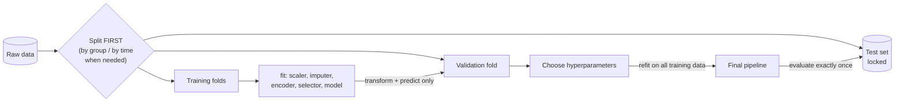

Here is a result I produced while writing this post: a classifier that scores **99.0% cross-validated accuracy** on a dataset where the labels are *pure coin flips*. Fifty samples, 5,000 features of random Gaussian noise, no signal anywhere. The code ran without a single warning. Change one line, and the same pipeline reports **49.7%**, which is the truth.
 
And here is a second one: a degree-15 polynomial that fits its 30 training points with a mean squared error of **0.009**, and then scores **70.3** on fresh data from the same source. That is about 1,170 times worse than predicting with the true curve itself, which scores 0.060 on the same test points.

These are the two ways a machine learning model lies to you:
 
- **Overfitting**: the model memorises its training data, so the *training* score flatters it.
- **Data leakage**: information from the evaluation data sneaks into training, so even the *test* score flatters it.

The first is the classic textbook villain. The second is worse, because it disables the very alarm you use to detect the first. In this post I document what I learned about both from my course (Chapter 8 of Vũ Hữu Tiệp's *Machine Learning cơ bản*), then go further: I derive the math, rebuild the experiments from scratch in C++ and Python, fact-check the textbook against the research literature, and show the geometry behind each idea. Everything quoted below is real output from code you can run yourself.

## 1. The Setup: What "Learning" Actually Promises

### 1.1 Training is a proxy, not the goal

In **supervised learning** we have $N$ training pairs $(\mathbf{x}_i, y_i)$ and look for a function $f$ such that $y_i \approx f(\mathbf{x}_i)$. The natural move is to choose the parameters $\boldsymbol{\theta}$ that minimise the **empirical risk**, the average loss on the training set:
 
$$\hat{R}(\boldsymbol{\theta}) = \frac{1}{N}\sum_{i=1}^{N} \ell\big(y_i, f_{\boldsymbol{\theta}}(\mathbf{x}_i)\big)$$
 
But that is not what we actually care about. We care about the **true risk** (also called the **generalization error**): the expected loss on a *new* pair drawn from the same distribution $\mathcal{D}$ that produced the data:
 
$$R(\boldsymbol{\theta}) = \mathbb{E}_{(\mathbf{x}, y) \sim \mathcal{D}}\Big[\ell\big(y, f_{\boldsymbol{\theta}}(\mathbf{x})\big)\Big]$$
 
We can never compute $R$ exactly, because we never see all of $\mathcal{D}$. Training minimises $\hat{R}$ and *hopes* $R$ follows. The difference
 
$$\text{generalization gap} = R(\boldsymbol{\theta}) - \hat{R}(\boldsymbol{\theta})$$
 
is the quantity this whole post is about. **Overfitting** is what happens when we push $\hat{R}$ down so aggressively that the gap explodes. A model that only describes its training set well has no **generalization** ability; a good model is one that generalizes.

### 1.2 Three error measures

The textbook defines errors for regression with the mean squared error. I'll use plain MSE; the book's version carries an extra factor $\frac{1}{2}$, which rescales every number but never changes which model wins:
 
$$\text{MSE}_{S} = \frac{1}{\lvert S \rvert}\sum_{(\mathbf{x}, y) \in S} \big(y - \hat{y}\big)^2, \qquad \hat{y} = f_{\boldsymbol{\theta}}(\mathbf{x})$$
 
Evaluated on three disjoint sets $S$:
 
| Set                | Used to...                                                                                    | Its error estimates...                                       |
| ------------------ | --------------------------------------------------------------------------------------------- | ------------------------------------------------------------ |
| **Training set**   | fit the **model parameters** $\boldsymbol{\theta}$ (polynomial coefficients, network weights) | nothing honest; it is biased low by construction             |
| **Validation set** | choose the **hyperparameters** (polynomial degree, $\lambda$, number of epochs)               | performance, but biased low by however much tuning you did   |
| **Test set**       | nothing: it is opened *once*, at the end                                                      | the true risk $R$, if the data are i.i.d. and nothing leaked |
 
The averaging matters (the book makes this point too): training and test sets can differ in size by orders of magnitude, and a sum would not be comparable across them.

## 2. Overfitting and Underfitting

### 2.1 A polynomial can always win on training data

The textbook builds its intuition on a classical fact: **Lagrange interpolation**. Given $N$ points $(x_1, y_1), \dots, (x_N, y_N)$ with distinct $x_i$, the polynomial
 
$$P(x) = \sum_{i=1}^{N} y_i \prod_{j \ne i} \frac{x - x_j}{x_i - x_j}$$
 
has degree at most $N - 1$ and passes through *every* point: $P(x_i) = y_i$. So with 30 training points, a degree-29 polynomial achieves zero training error, no matter how noisy the data are. Zero training error is therefore not evidence of a good model; with enough capacity it is guaranteed.

### 2.2 Reproducing from scratch

To see this, I generated data exactly like the book's setup: a **true model** that is a cubic, $f(x) = 1.5x^3 - x^2 - x + 0.5$, plus Gaussian noise with $\sigma = 0.25$. Thirty training points, fifteen validation points, and 1,000 test points, all drawn i.i.d. from $x \sim \mathcal{U}[-1, 1]$. Each model uses the feature vector $\phi(x) = [1, x, x^2, \dots, x^d]^\top$ and ordinary least squares, solved by a hand-written C++ program.


Read the training MSE in each title from left to right: 0.218, 0.042, 0.021, 0.009. It falls monotonically, as it must, since each model contains the previous one as a special case. The test MSE tells the real story: 0.209, **0.064**, 0.125, **70.3**.
 
- **Degree 1 is underfitting.** A straight line cannot bend, so it misses the structure *everywhere*, on training and test data alike.
- **Degree 3 is a good fit.** Its test MSE of 0.0638 sits right next to the noise variance $\sigma^2 = 0.0625$, the best any model could possibly do.
- **Degree 9 and 15 are overfitting.** They spend their extra flexibility modelling the *noise* in these particular 30 points. Look at the degree-15 curve near $x = 0.8$: it shoots off the chart in the gap between two training points, because nothing in the training loss tells it not to.

### 2.3 The diagnosis table
 
Comparing the two errors gives a quick diagnosis, the one the textbook states in prose:
 
|                         | **Test error low**        | **Test error high**             |
| ----------------------- | ------------------------- | ------------------------------- |
| **Training error low**  | good fit                  | **overfitting** (high variance) |
| **Training error high** | rare (see the note below) | **underfitting** (high bias)    |
 
The book says the bottom-left cell is very unlikely. That's true for plain models, with one practical exception worth knowing: with **dropout** or heavy data augmentation, the training loss is computed on a deliberately handicapped network, so it is common to see *training* loss above *validation* loss. That is not a bug; it is the regularizer doing its job.

## 3. Why It Happens: Bias, Variance, and Noise
 
The textbook points to the bias–variance trade-off only as further reading. It is the actual mechanism, so let's derive it.
 
### 3.1 The decomposition
 
Imagine repeating the whole experiment many times: draw a fresh training set, fit $\hat{f}$, predict at a fixed point $\mathbf{x}$. The prediction $\hat{f}(\mathbf{x})$ is now a random variable. For squared loss and $y = f(\mathbf{x}) + \varepsilon$ with $\mathbb{E}[\varepsilon] = 0$, $\operatorname{Var}(\varepsilon) = \sigma^2$, the expected test error splits exactly into three parts:
 
$$\mathbb{E}\Big[\big(y - \hat{f}(\mathbf{x})\big)^2\Big] = \underbrace{\Big(f(\mathbf{x}) - \mathbb{E}\big[\hat{f}(\mathbf{x})\big]\Big)^2}_{\text{bias}^2} + \underbrace{\operatorname{Var}\big[\hat{f}(\mathbf{x})\big]}_{\text{variance}} + \underbrace{\sigma^2}_{\text{irreducible noise}}$$
 
The derivation is two lines: add and subtract $\mathbb{E}[\hat{f}(\mathbf{x})]$ inside the square, expand, and notice that every cross term has expectation zero because the noise $\varepsilon$ on the test point is independent of the training set.
 
- **Bias** measures how wrong the *average* model is. It is the error of the model *family*.
- **Variance** measures how much the model changes when the training set changes. It is the price of flexibility.
- **Noise** $\sigma^2$ is a floor no model can go below.

### 3.2 Measuring it, instead of drawing a cartoon
 
Most explanations show a hand-drawn U-shaped curve. I estimated the three terms directly by Monte Carlo: 500 independent training sets of $n = 30$, one fit per set, predictions on 2,000 evaluation points.
 

_Top: each thin orange line is one model trained on a different random training set. Degree 1 lines agree with each other but are all wrong (bias); degree 9 lines are right on average but disagree wildly (variance). Bottom: the measured decomposition._
 
| Degree | Bias²  | Variance | Bias² + Var + σ² |
| ------ | ------ | -------- | ---------------- |
| 1      | 0.1335 | 0.0182   | 0.2142           |
| 3      | 0.0000 | 0.0103   | **0.0728**       |
| 6      | 0.0004 | 0.1312   | 0.1942           |
| 9      | 0.0036 | 4.8059   | 4.8721           |
| 12     | 17.29  | 16,092   | 16,109           |
 
Two things here are worth explaining rather than smoothing over:
 
- **Why is degree 3's bias exactly zero but degree 6's not?** The true function *is* a cubic, so every degree $\ge 3$ contains it and has zero true bias. The small nonzero values from degree 6 on are a Monte Carlo artefact: my estimate uses the average of $S = 500$ fits, and the estimated bias² is inflated by roughly $\text{Var}/S$. At degree 12 that is $16{,}092 / 500 \approx 32$, the same order as the reported 17.3. When variance is astronomical, even estimating the *average* model becomes unstable.
- **Why does variance explode so violently at high degree?** Because a high-degree polynomial must extrapolate between and beyond the training points, and $x^{12}$ amplifies tiny coefficient changes into enormous swings near $x = \pm 1$. That's the edge behaviour visible in Figure 8.1(d) of the textbook and in my degree-15 panel above.
### 3.3 More data is a variance cure
 
If variance comes from having too few points to pin the model down, then more points should shrink it. This is what **learning curves** show: error as a function of training-set size, with model capacity held fixed.
 

_Median train and test MSE over 200 repetitions. With the right capacity (left), the gap is small from the start. With too much capacity (right), the gap is enormous at small n and closes as data grows._
 
The degree-12 model has a median test MSE of **173,372** at $n = 15$, **0.985** at $n = 30$, and **0.0635** at $n = 500$, practically equal to the degree-3 model's 0.0623. The textbook's statement that overfitting "especially occurs when the training data is too small or the model is too complex" is exactly right, and the two causes are really one: overfitting is about the *ratio* of model capacity to data.
 
Reading a learning curve also tells you what to do next:

## 4. Model Selection Without Peeking: Validation and Cross-Validation
 
### 4.1 The validation set
 
We can't use the test set to choose the degree (that would make it a training set in disguise), and we can't use training error (it always prefers the biggest model). The textbook's answer is the **validation set**: carve a subset out of the training data, fit on the rest, evaluate on the carved-out part. The book's analogy is good: when revising for an exam, you study some past papers *with* the solutions and attempt the others *without* them, to see where you really stand.
 
Here is that procedure on my data, degree 0 through 15:
 

_Training error (blue) only goes down. Validation (orange) and test (green) error trace the U-shape, bottoming out near the noise floor. The 15-point validation set picks degree 4. Generated by `figures.py`._
 
| Degree | Train MSE | Val MSE (15 pts) | Test MSE (1000 pts) |
| ------ | --------- | ---------------- | ------------------- |
| 1      | 0.21795   | 0.2143           | 0.2086              |
| 3      | 0.04198   | 0.0621           | **0.0638**          |
| 4      | 0.04108   | **0.0598**       | 0.0645              |
| 9      | 0.02076   | 0.1059           | 0.1245              |
| 15     | 0.00906   | 81.2024          | 70.3446             |
 
The validation set chooses **degree 4**; the test set would have preferred **degree 3**. That's the same "three or four" conclusion the textbook reaches, and the difference costs only 0.0007 in test MSE. Validation is a noisy estimate, so it picks a *good* model, not necessarily *the best* one.
 
A curiosity: degrees 7 and 8 print identical errors to four decimals. That isn't a bug (I cross-checked the C++ solver against NumPy's `polyfit`, which agrees to every printed digit). The degree-8 least-squares fit simply assigns $x^8$ a coefficient of $-0.037$, so the extra term barely changes anything.
 
### 4.2 k-fold cross-validation
 
With little data, a single validation split is wasteful (those points never train the model) and noisy (15 points is a small sample). **k-fold cross-validation** fixes both: split the training set into $k$ disjoint folds of roughly equal size, train $k$ times, each time holding out a different fold, and average:
 
$$\text{CV}_{(k)} = \frac{1}{k}\sum_{j=1}^{k} \text{Err}_j, \qquad \text{Err}_j = \text{error on fold } j \text{ of the model trained on the other } k-1 \text{ folds}$$
 

_5-fold cross-validation. Every sample is used for validation exactly once. The test set sits outside the whole loop._
 
With $k = N$ (one sample per fold) this becomes **leave-one-out** cross-validation, as the textbook notes.
 
> **Fact-check (textbook, Section 8.2.2), three imprecisions:**
> 1. The book says the final model is determined "based on the average of the training errors and validation errors." Model selection should use the **average validation error** only; training error says nothing about generalization. After choosing the hyperparameters, the standard practice is to **refit on the full training set**, since the $k$ fold-models are only measurement instruments.
> 2. The book says that with a tiny validation set, "overfitting can occur again on the remaining training set." The real problem is different: a tiny validation set gives a **high-variance estimate**, and if you compare many models on it, you start **overfitting the validation set itself**. Section 6.5 measures this effect.
> 3. Cross-validation's score is an honest estimate only for a model whose hyperparameters were *not* chosen by that same score. If you tune with CV and report the best CV score, use **nested cross-validation** or a held-out test set for the final number.
 
## 5. Regularization: Paying for Complexity
 
Cross-validation trains $k$ models per candidate hyperparameter. The textbook motivates **regularization** as a cheaper route: change the model slightly, sacrificing some training accuracy to reduce complexity, so it can't chase noise.
 
### 5.1 Early stopping
 
Iterative optimisers fit the coarse structure of the data first and the fine detail (including noise) later. Stopping before convergence therefore acts like a complexity limit, where the "complexity knob" is the number of iterations.
 
I trained the degree-15 model with plain full-batch gradient descent, step size $\eta = 1/L$ where $L$ is the largest eigenvalue of the Hessian, starting from $\mathbf{w}_0 = \mathbf{0}$, and logged all three errors for ten million iterations:
 

_Left: validation error bottoms out at iteration 1,623 and climbs afterwards, while training error keeps falling. Right: the same model after 100 iterations (too smooth), 1,623 (about right), and 10 million (wiggly)._
 
| Stopping point                           | Train MSE | Val MSE    | Test MSE   |
| ---------------------------------------- | --------- | ---------- | ---------- |
| Best validation error (iteration 1,623)  | 0.0382    | **0.0561** | **0.0665** |
| After 10,000,000 iterations              | 0.0156    | 0.1733     | 0.1661     |
| Exact least-squares solution (C++ table) | 0.00906   | 81.2024    | 70.3446    |
 
Here's the surprising part: after **ten million** iterations, gradient descent is still nowhere near the exact least-squares solution, whose test MSE is 70.3. Why? After standardizing the features, the Hessian of the loss has eigenvalues from 15.1 down to $1.98 \times 10^{-11}$, a **condition number** of about $7.6 \times 10^{11}$. With $\eta = 1/L$, the error along the eigenvector with eigenvalue $\mu_i$ shrinks by a factor $(1 - \eta\mu_i)$ per step, so the flattest directions need on the order of $10^{12}$ iterations to be fitted. And those flat directions are exactly the high-frequency wiggles that encode noise.
 
This gives a precise link between early stopping and the penalty methods below. In the eigenbasis of the Hessian (eigenvalues $\mu_i$), starting from zero, and with the ridge penalty $\lambda$ expressed in the same normalisation as the loss:
 
$$w^{\text{GD}}_{t,i} = \Big[1 - (1 - \eta\mu_i)^t\Big]\, w^{\text{LS}}_i, \qquad w^{\text{ridge}}_i = \frac{\mu_i}{\mu_i + \lambda}\, w^{\text{LS}}_i$$
 
Both multiply each least-squares component by a factor near 1 for large $\mu_i$ and near 0 for small $\mu_i$. Early stopping with $t$ iterations behaves roughly like ridge with $\lambda \approx 1/(\eta t)$; Goodfellow, Bengio and Courville make this argument formally in *Deep Learning*, Section 7.8. (One more honest detail from the logs: the *test* error was lowest at iteration 464, not 1,623. Validation picks a good stopping point, not the perfect one.)
 
### 5.2 Adding a penalty term to the loss
 
The more common technique adds a term that measures complexity:
 
$$L_{\text{reg}}(\boldsymbol{\theta}) = L(\boldsymbol{\theta}) + \lambda R(\boldsymbol{\theta}), \qquad \lambda \ge 0$$
 
where $R$ depends only on the parameters. With $R(\mathbf{w}) = \lVert\mathbf{w}\rVert_2^2$ on linear regression we get **ridge regression**, which has a closed-form solution:
 
$$\mathbf{w}^{\text{ridge}} = \left(X^\top X + \lambda I\right)^{-1} X^\top \mathbf{y}$$
 
Adding $\lambda I$ lifts every eigenvalue of $X^\top X$ by $\lambda$, so a nearly singular, wildly ill-conditioned matrix becomes safely invertible. (In practice the intercept is left unpenalised, which my C++ program does.)
 
Here is the same degree-15 model, with the same 30 points, under different penalties:


_Left: λ = 0 overfits, λ = 10 underfits (nearly flat), λ = 0.01 recovers the true curve. Right: sweeping λ traces the U-curve again, now in reverse: small λ means high capacity._
 
| $\lambda$ | Train MSE | Val MSE    | Test MSE   | $\lVert\mathbf{w}\rVert_2$ |
| --------- | --------- | ---------- | ---------- | -------------------------- |
| 0         | 0.00906   | 81.2024    | 70.3446    | 45,173.59                  |
| $10^{-8}$ | 0.01374   | 0.9787     | 0.7212     | 1,465.23                   |
| $10^{-4}$ | 0.02020   | 0.0888     | 0.0950     | 32.80                      |
| $10^{-2}$ | 0.03667   | **0.0585** | **0.0660** | 3.74                       |
| $1$       | 0.06534   | 0.0635     | 0.0757     | 0.90                       |
| $10$      | 0.13665   | 0.1191     | 0.1321     | 0.30                       |
 
The weight norm column is the cleanest illustration of what overfitting *is* numerically: to thread the noise, the unregularized model needs coefficients in the tens of thousands that nearly cancel each other. A penalty of just $10^{-8}$ cuts the norm by 30× and the test error by 100×. With 16 features and only 30 points, ridge at $\lambda = 10^{-2}$ performs essentially as well as the "correct" cubic (0.0660 vs. 0.0638), without anyone telling it the true degree.
 
> **Fact-check (textbook, Section 8.3):**
> - *"Regularization reduces the number of models to train, even to just one."* Not quite: $\lambda$ is itself a hyperparameter, and you still pick it by validation, as the table above does. What regularization buys is a **single continuous knob** instead of a discrete family of architectures, which is far easier to search.
> - *"λ is usually a small positive number."* The useful scale of $\lambda$ depends on how the loss is normalised (sum vs. mean, the $\frac{1}{2}$ factor) and on the scale of the features. Here good values span $10^{-2}$ to $1$; scikit-learn's `Ridge` defaults to `alpha=1.0`. There is no universally "small" value; tune it on a log grid.
 
### 5.3 ℓ1 vs. ℓ2: why one gives zeros and the other doesn't
 
Choosing $R(\mathbf{w}) = \lVert\mathbf{w}\rVert_1$ instead gives **LASSO** regression, whose solutions tend to be **sparse** (many coefficients exactly zero). The textbook states this; the geometry explains it. Minimising $L + \lambda R$ is equivalent (for a suitable budget $t$) to minimising $L$ subject to $R(\mathbf{w}) \le t$. The solution is the first point where the loss's elliptical level sets touch the constraint region:


_Same loss, same budget t = 1. The ℓ1 diamond has corners on the axes, and the expanding ellipse hits the corner (1, 0): w₂ is exactly 0. The ℓ2 disk has no corners, so the contact point (0.89, 0.45) has both weights nonzero. Optima found numerically._
 
In high dimensions the ℓ1 ball is a cross-polytope whose corners and edges all lie on coordinate subspaces, and loss contours hit them with high probability. On a real dataset (scikit-learn's diabetes data, 10 standardized features), sweeping the penalty shows the difference directly:
 

 
| LASSO $\alpha$                | 0.01 | 0.1 | 1   | 5   | 10  | 20  |
| ----------------------------- | ---- | --- | --- | --- | --- | --- |
| Non-zero coefficients (of 10) | 10   | 9   | 7   | 5   | 4   | 3   |
 
Ridge kept all 10 coefficients non-zero at every penalty I tried. This is why the book rightly calls LASSO a **feature selection** method.
 
> **Fact-check (textbook, Section 8.3.2):** *"ℓ1 regularization is said to make the model more robust (less affected by noise) than ℓ2."* This conflates two different things. The **ℓ1 loss** (mean *absolute* error) is indeed robust to *outliers in y*, because it doesn't square large residuals. The **ℓ1 penalty** on the weights is about **sparsity**, not robustness. In fact, with groups of correlated features, LASSO tends to pick one feature arbitrarily and can flip its choice under small data changes, which is the instability the **elastic net** (Zou & Hastie, 2005) was designed to fix. The book's other claim checks out: $\lvert w \rvert$ has no derivative at 0, so LASSO needs subgradient or coordinate-descent solvers (scikit-learn's `Lasso` uses coordinate descent), while ridge has a closed form.
 
### 5.4 Other regularizers in modern practice
 
- **Weight decay** is the neural-network name for ℓ2 regularization. The textbook cites it as "A. Krogh *et al.*"; the paper has exactly two authors, **Anders Krogh and John A. Hertz**, *A Simple Weight Decay Can Improve Generalization*, NIPS 4 (conference held in 1991, proceedings published 1992). One modern subtlety: with adaptive optimisers like Adam, adding $\lambda\lVert\mathbf{w}\rVert^2$ to the loss is *not* equivalent to decaying the weights directly; that observation led to **AdamW** (Loshchilov & Hutter, ICLR 2019).
- **Dropout** (Srivastava *et al.*, JMLR 15(1), 1929–1958, 2014; the textbook's citation is correct) randomly zeroes units during training so the network can't rely on any single co-adapted path.
- **Data augmentation** adds label-preserving transformations (flips, crops, noise), effectively enlarging $N$, which attacks variance at its source (Section 3.3).

## 6. Data Leakage: When the Test Set Isn't Really Unseen
 
### 6.1 Definition
 
Everything so far assumed one thing: that the validation and test sets are *genuinely unseen*. **Data leakage** is what happens when they aren't. The standard definition comes from Kaufman, Rosset, Perlich and Stitelman (*ACM TKDD*, 2012): leakage is the introduction of information about the prediction target that would not legitimately be available at prediction time. They open their paper by noting it has been called one of the top ten data mining mistakes.
 
The textbook's chapter doesn't mention leakage at all, even though its whole validation strategy depends on avoiding it. That's a significant gap, because leakage is not a beginner's problem. Kapoor and Narayanan (*Patterns*, 2023) surveyed reviews across the sciences and found leakage affecting **at least 294 papers in 17 fields**. In their own case study on civil-war prediction, every paper that claimed complex ML beat logistic regression turned out to contain leakage; once fixed, the complex models did no better than the baseline.
 
### 6.2 Overfitting vs. leakage, side by side
 
|                         | **Overfitting**                                 | **Data leakage**                                                   |
| ----------------------- | ----------------------------------------------- | ------------------------------------------------------------------ |
| What goes wrong         | model learns noise specific to the training set | evaluation data (or future/target information) influences training |
| Training score          | too optimistic                                  | too optimistic                                                     |
| Validation / test score | **honest**: drops, revealing the problem        | **also too optimistic**: the alarm is disabled                     |
| When you find out       | during development                              | in production, or when someone tries to reproduce the paper        |
| Typical cause           | too much capacity for too little data           | preprocessing on all data, bad splits, features from the future    |
| Fix                     | regularization, more data, simpler model        | fix the *pipeline*; no amount of regularization helps              |
 
That last row is the key: overfitting is a property of the **model**; leakage is a property of the **procedure**. Cross-validation estimates how well the *entire* procedure generalizes, so every step that learns anything from data (scaling, imputation, feature selection, encoding, tuning) is part of the model and must happen inside the training fold.
 
### 6.3 A taxonomy
 
Kapoor and Narayanan group leakage into eight types. I'll use their labels and map each to the demo that reproduces it:
 
| Type                                       | Description                                                          | Demo below                         |
| ------------------------------------------ | -------------------------------------------------------------------- | ---------------------------------- |
| **L1.1** No test set                       | evaluating on the training data                                      | — (Section 2 shows why that fails) |
| **L1.2** Preprocessing on train + test     | imputation, encoding, scaling fitted on all rows                     | target encoding; scaling           |
| **L1.3** Feature selection on train + test | choosing features using all rows                                     | feature selection on noise         |
| **L1.4** Duplicates                        | the same sample in both sets                                         | (special case of L3.2)             |
| **L2** Illegitimate features               | proxies of the target, or information unavailable at prediction time | centered rolling mean              |
| **L3.1** Temporal leakage                  | training on the future to predict the past                           | centered rolling mean              |
| **L3.2** Non-independence                  | e.g. the same patient in train and test                              | patient-level split                |
| **L3.3** Sampling bias                     | test set not representative of deployment                            | —                                  |
 
To these I add one that's subtler: **overfitting the validation set** by repeatedly selecting on it, where the leaked "information" is your own model-selection decisions.
 
The safe workflow fits everything inside the fold:
 

 
### 6.4 The geometry of a leak
 
Why can selecting features on the full dataset manufacture accuracy out of thin air? Take 50 samples, 5,000 noise features, and labels that are a fixed half/half split. Among 5,000 random features, *some* will correlate with the labels by pure chance, and if you search the whole dataset for them, you will find them:
 

_Left: the two highest-scoring of 5,000 pure-noise features, plotted on the 50 samples that were used to rank them. The classes look separable. Right: the same two features on 50 fresh samples. The pattern vanishes, because it was never there. Generated by `figures.py`._
 
The left panel is what your cross-validation sees if selection happened before the split: the validation fold's samples *helped choose* the features, so of course they look separable in that space. The model isn't overfitting; the *evaluation* is.
 
### 6.5 Five leaks, reproduced
 
Every scenario below has labels that are **independent of the features**, so the true accuracy is exactly 0.5 in every case. That makes the inflation unambiguous.


_The orange bars are what a leaky pipeline would report. The blue bars come from the same data with a leak-free procedure. Generated by `figures.py` from `experiments.py`._
 
**1. Feature selection before cross-validation (L1.3).** This replicates the "wrong way to do cross-validation" example from Hastie, Tibshirani and Friedman's *Elements of Statistical Learning* (Section 7.10.2): 50 samples, 5,000 noise features, keep the 100 most correlated with the label, classify with 1-nearest-neighbour. ESL reports a cross-validated error of about 3% against a true error of 50%. Over 20 random seeds I got:
 
```text
wrong CV accuracy: 0.990 ± 0.012  (min 0.96, max 1.00)
right CV accuracy: 0.497 ± 0.103
```
 
That's an average error of 1%, consistent with the book's 3%. The fix is one line: make selection a step *of the model*.
 
```python
from sklearn.feature_selection import SelectKBest, f_classif
from sklearn.neighbors import KNeighborsClassifier
from sklearn.pipeline import make_pipeline
from sklearn.model_selection import cross_val_score
 
# WRONG: SelectKBest sees every sample, including each validation fold
X_sel = SelectKBest(f_classif, k=100).fit_transform(X, y)
wrong = cross_val_score(KNeighborsClassifier(1), X_sel, y, cv=cv).mean()
 
# RIGHT: the pipeline is refitted from scratch inside every training fold
pipe = make_pipeline(SelectKBest(f_classif, k=100), KNeighborsClassifier(1))
right = cross_val_score(pipe, X, y, cv=cv).mean()
```
 
The scikit-learn documentation's "Common pitfalls" page makes the same point with a similar setup (random features, random labels) and reports 0.76 for the leaky version vs. 0.5 for the pipeline.
 
**2. Target encoding fitted on all rows (L1.2).** **Target encoding** replaces a categorical value with the mean target of its category, which is popular for high-cardinality columns like user or product IDs. With 2,000 rows, 1,000 categories (about two rows each) and a random binary target, encoding with means computed over *all* rows lets each validation row's own label leak into its feature: **0.775** reported vs. **0.507** with scikit-learn's `TargetEncoder` inside a pipeline. (`TargetEncoder.fit_transform` also uses internal cross-fitting, so even on the training fold a row never sees its own label.)
 
**3. The same patient in train and test (L3.2).** Simulate 100 patients with 10 records each; records of one patient are near-duplicates, and each patient's diagnosis is random. A random record-level `KFold` puts most of a patient's records in training and a few in validation, so the model just recognises the patient: **0.999**. Splitting by patient with `GroupKFold` gives **0.502**.
 
```python
from sklearn.model_selection import KFold, GroupKFold
 
record_cv  = cross_val_score(model, X, y, cv=KFold(5, shuffle=True, random_state=42))
patient_cv = cross_val_score(model, X, y, cv=GroupKFold(5), groups=patient_id)
```
 
This is the most common leak in medical imaging (many slices or scans per patient), speech (many clips per speaker) and any dataset with repeated measurements.
 
**4. A feature that peeks at the future (L2 / L3.1).** On a pure random walk, predict whether tomorrow's value goes up. Using past returns only: **0.494**, as it should be. Add one innocent-looking feature, the gap between today's value and a *centered* 5-day moving average (`rolling(5, center=True)`, which averages days $t-2$ to $t+2$): **0.844**. Note that I used `TimeSeriesSplit`, the *correct* splitter for time series. **A correct split does not protect you from a leaky feature**: the feature itself contains $x_{t+1}$.
 
**5. Overfitting the validation set (the winner's curse).** Generate 1,000 "models" that are literally coin flips, evaluate each on the same 100-sample validation set, and keep the best. Across 20 runs, the winner scored **0.661 ± 0.022** on validation and **0.501** on a fresh 10,000-sample test set. Nothing leaked from the test set; the validation score was inflated purely by *selecting the maximum of many noisy estimates*. This is why heavily tuned models need a final, untouched test set, and why Kaggle's public leaderboard can mislead people who submit too often.
 
### 6.6 Not every leak is equally dangerous
 
Here's a counterintuitive result I didn't expect. Fitting a `StandardScaler` on the full wine dataset before cross-validating a 5-NN classifier, versus fitting it inside the pipeline, changed accuracy by an average of **−0.0005** over 20 seeds (range −0.011 to +0.006). On this dataset the leak is real but numerically irrelevant.
 
The reason is how much *target* information a step absorbs. A scaler learns only a mean and a standard deviation per column, and with 160 training rows, adding 18 validation rows barely moves them. Feature selection and target encoding, by contrast, are **supervised**: they look at $y$ directly, and that is what turns chance correlations into fake accuracy. This doesn't make leaky scaling acceptable (it can matter with tiny datasets, heavy outliers, or statistics like min/max), but it explains why the supervised leaks above are so much more destructive. Since a `Pipeline` costs nothing, the right habit is to put *every* fitted step inside one.
 
### 6.7 A leakage detection checklist
 
- **Too good to be true is a signal.** If a model beats published baselines by a wide margin on a hard problem, look for leakage before celebrating.
- **Inspect feature importances.** One feature dominating everything is often a target proxy (an "account closed date" in a churn model; a "treatment given" field when predicting diagnosis).
- **Ask "would I know this at prediction time?"** for every feature, with timestamps. If the answer is "only afterwards", it's L2/L3.1.
- **Search for duplicates and groups** across your splits (hash the rows; check patient, user, device or session IDs).
- **Split by the unit you will deploy on**: by patient for new patients, by time for forecasting, by user for new users.
- **Keep a final test set you have never looked at**, and use it once.
- Kapoor and Narayanan propose **model info sheets**, a documentation template that forces you to justify train-test separation and feature legitimacy for each claim.
## 7. Where This Shows Up in Real AI Systems
 
| Domain                      | Typical overfitting risk              | Typical leakage trap                                                        |
| --------------------------- | ------------------------------------- | --------------------------------------------------------------------------- |
| **Medical imaging**         | small datasets, large CNNs            | multiple images of one patient across splits (L3.2)                         |
| **Time-series forecasting** | flexible models on short histories    | random shuffling; centered windows; features revised after the fact         |
| **Fraud and churn**         | rare positives, many features         | fields filled in *after* the event (chargeback flags, cancellation reasons) |
| **Tabular competitions**    | tuning against the public leaderboard | target encoding or feature selection on train + test                        |
| **NLP and LLM benchmarks**  | memorising benchmark quirks           | test questions present in web-scale training data (contamination)           |
| **Scientific ML**           | few samples, many measurements        | preprocessing and feature selection before splitting (L1.2, L1.3)           |
 
A related and reassuring data point: Recht *et al.* (ICML 2019) rebuilt fresh test sets for CIFAR-10 and ImageNet following the original collection process, and found accuracy drops of 3–15% and 11–14% respectively. Surprisingly, they attributed the drop **not** to years of the community adaptively overfitting the old test sets, but to models failing on slightly "harder" images. The relative ranking of models largely held. So test-set reuse is real but slower-acting than one might fear; distribution shift, which is a cousin of L3.3, was the bigger effect.
 
## 8. Demo 1: Overfitting from Scratch in C++
 
The program below generates the data, fits polynomials of degree 0–15 and the ridge sweep, and writes `data.csv` for the plotting script. Following this blog's convention, it uses no `std::vector`, no `<random>` and no linear algebra library: raw arrays with manual `new[]`/`delete[]`, a hand-written PRNG, and a Householder QR solver.
 
```cpp
// poly_overfit.cpp — Overfitting from scratch: polynomial regression + ridge.
// No std::vector, no <random>, no Eigen: raw arrays, manual new[]/delete[],
// a hand-written PRNG, and a Householder QR least-squares solver.
//
// Build: g++ -std=c++17 -O2 -Wall -Wextra -o poly_overfit poly_overfit.cpp
// Run:   ./poly_overfit            (also writes data.csv for the plotting script)
#include <cstdio>
#include <cmath>
#include <cstdint>
 
// ---------------- 1. Deterministic PRNG (splitmix64) + Box-Muller ----------------
static uint64_t rng_state = 42;
uint64_t next_u64() {
    uint64_t z = (rng_state += 0x9E3779B97F4A7C15ULL);
    z = (z ^ (z >> 30)) * 0xBF58476D1CE4E5B9ULL;
    z = (z ^ (z >> 27)) * 0x94D049BB133111EBULL;
    return z ^ (z >> 31);
}
double uniform01() { return (next_u64() >> 11) * (1.0 / 9007199254740992.0); } // [0,1)
double normal01() {                                    // Box-Muller transform
    double u1 = uniform01(), u2 = uniform01();
    if (u1 < 1e-300) u1 = 1e-300;
    return std::sqrt(-2.0 * std::log(u1)) * std::cos(2.0 * M_PI * u2);
}
 
// The "true model" the learner never sees: a cubic, as in the textbook's Figure 8.1.
double true_f(double x) { return 1.5 * x * x * x - x * x - x + 0.5; }
const double NOISE_SD = 0.25;
 
void make_data(double* x, double* y, int n) {
    for (int i = 0; i < n; ++i) {
        x[i] = 2.0 * uniform01() - 1.0;                // x ~ U[-1, 1]
        y[i] = true_f(x[i]) + NOISE_SD * normal01();   // y = f(x) + noise
    }
}
 
// ---------------- 2. Feature map: phi(x) = [1, x, x^2, ..., x^d] ----------------
// Fills a row-major (n x (d+1)) design matrix. Horner-free: just repeated products.
void design_matrix(const double* x, int n, int d, double* A) {
    for (int i = 0; i < n; ++i) {
        double p = 1.0;
        double* row = A + i * (d + 1);
        for (int j = 0; j <= d; ++j) { row[j] = p; p *= x[i]; }
    }
}
 
// ---------------- 3. Least squares via Householder QR ----------------
// Solves min ||A w - b||_2 for A (m x n, m >= n), row-major. A and b are overwritten.
// QR is used instead of the normal equations (A^T A) w = A^T b because forming
// A^T A squares the condition number — fatal for high-degree Vandermonde matrices.
bool lstsq_qr(double* A, double* b, int m, int n, double* w) {
    double* v = new double[m];
    for (int k = 0; k < n; ++k) {
        double norm = 0.0;
        for (int i = k; i < m; ++i) norm += A[i * n + k] * A[i * n + k];
        norm = std::sqrt(norm);
        if (norm < 1e-300) { delete[] v; return false; }
        double alpha = (A[k * n + k] > 0) ? -norm : norm;   // sign chosen to avoid cancellation
        for (int i = k; i < m; ++i) v[i] = A[i * n + k];
        v[k] -= alpha;
        double vnorm2 = 0.0;
        for (int i = k; i < m; ++i) vnorm2 += v[i] * v[i];
        if (vnorm2 < 1e-300) continue;
        // Apply H = I - 2 v v^T / (v^T v) to the remaining columns and to b.
        for (int j = k; j < n; ++j) {
            double dot = 0.0;
            for (int i = k; i < m; ++i) dot += v[i] * A[i * n + j];
            double s = 2.0 * dot / vnorm2;
            for (int i = k; i < m; ++i) A[i * n + j] -= s * v[i];
        }
        double dot = 0.0;
        for (int i = k; i < m; ++i) dot += v[i] * b[i];
        double s = 2.0 * dot / vnorm2;
        for (int i = k; i < m; ++i) b[i] -= s * v[i];
    }
    for (int k = n - 1; k >= 0; --k) {                  // back substitution R w = Q^T b
        double acc = b[k];
        for (int j = k + 1; j < n; ++j) acc -= A[k * n + j] * w[j];
        w[k] = acc / A[k * n + k];
    }
    delete[] v;
    return true;
}
 
// Fits degree-d polynomial with ridge penalty lambda * sum_{j>=1} w_j^2 (intercept free).
// Ridge is solved as ordinary least squares on an augmented system:
//   [ A            ]       [ y ]
//   [ sqrt(lam) I' ] w  ~  [ 0 ]
bool fit_poly(const double* x, const double* y, int n, int d, double lambda, double* w) {
    int p = d + 1;
    int extra = (lambda > 0.0) ? d : 0;
    int m = n + extra;
    double* A = new double[m * p];
    double* b = new double[m];
    design_matrix(x, n, d, A);
    for (int i = 0; i < n; ++i) b[i] = y[i];
    for (int r = 0; r < extra; ++r) {
        double* row = A + (n + r) * p;
        for (int j = 0; j < p; ++j) row[j] = 0.0;
        row[r + 1] = std::sqrt(lambda);                 // skip column 0 (intercept)
        b[n + r] = 0.0;
    }
    bool ok = lstsq_qr(A, b, m, p, w);
    delete[] A; delete[] b;
    return ok;
}
 
double predict(const double* w, int d, double x) {      // Horner's rule
    double acc = 0.0;
    for (int j = d; j >= 0; --j) acc = acc * x + w[j];
    return acc;
}
 
double mse(const double* w, int d, const double* x, const double* y, int n) {
    double s = 0.0;
    for (int i = 0; i < n; ++i) { double r = predict(w, d, x[i]) - y[i]; s += r * r; }
    return s / n;
}
 
int main() {
    const int N_TRAIN = 30, N_VAL = 15, N_TEST = 1000, MAX_D = 15;
    double* xtr = new double[N_TRAIN]; double* ytr = new double[N_TRAIN];
    double* xva = new double[N_VAL];   double* yva = new double[N_VAL];
    double* xte = new double[N_TEST];  double* yte = new double[N_TEST];
    make_data(xtr, ytr, N_TRAIN);
    make_data(xva, yva, N_VAL);
    make_data(xte, yte, N_TEST);
 
    double* w = new double[MAX_D + 1];
 
    // ----- Experiment A: model complexity (degree) vs. error -----
    std::printf("Irreducible error (noise variance) = %.4f\n\n", NOISE_SD * NOISE_SD);
    std::printf("degree  train_MSE   val_MSE    test_MSE\n");
    for (int d = 0; d <= MAX_D; ++d) {
        if (!fit_poly(xtr, ytr, N_TRAIN, d, 0.0, w)) { std::printf("%6d  singular\n", d); continue; }
        std::printf("%6d  %9.5f  %9.4f  %10.4f\n", d,
                    mse(w, d, xtr, ytr, N_TRAIN), mse(w, d, xva, yva, N_VAL), mse(w, d, xte, yte, N_TEST));
    }
 
    // ----- Experiment B: degree-15 model tamed by ridge (L2) regularization -----
    const int D = 15;
    const double lambdas[] = { 0.0, 1e-8, 1e-6, 1e-4, 1e-3, 1e-2, 1e-1, 1.0, 10.0 };
    std::printf("\nDegree %d with ridge penalty\n", D);
    std::printf("  lambda   train_MSE   val_MSE    test_MSE    ||w||_2\n");
    for (double lam : lambdas) {
        fit_poly(xtr, ytr, N_TRAIN, D, lam, w);
        double nrm = 0.0;
        for (int j = 1; j <= D; ++j) nrm += w[j] * w[j];
        std::printf("%8.0e  %9.5f  %9.4f  %10.4f  %10.2f\n", lam,
                    mse(w, D, xtr, ytr, N_TRAIN), mse(w, D, xva, yva, N_VAL),
                    mse(w, D, xte, yte, N_TEST), std::sqrt(nrm));
    }
 
    // ----- Dump the data so Python can plot exactly the same points -----
    FILE* f = std::fopen("data.csv", "w");
    if (f) {
        std::fprintf(f, "split,x,y\n");
        for (int i = 0; i < N_TRAIN; ++i) std::fprintf(f, "train,%.17g,%.17g\n", xtr[i], ytr[i]);
        for (int i = 0; i < N_VAL; ++i)   std::fprintf(f, "val,%.17g,%.17g\n", xva[i], yva[i]);
        for (int i = 0; i < N_TEST; ++i)  std::fprintf(f, "test,%.17g,%.17g\n", xte[i], yte[i]);
        std::fclose(f);
    }
 
    delete[] xtr; delete[] ytr; delete[] xva; delete[] yva; delete[] xte; delete[] yte; delete[] w;
    return 0;
}
```
 
Build and run:
 
```bash
g++ -std=c++17 -O2 -Wall -Wextra -o poly_overfit poly_overfit.cpp
./poly_overfit
```
 
Full output:
 
```text
Irreducible error (noise variance) = 0.0625
 
degree  train_MSE   val_MSE    test_MSE
     0    0.21835     0.2178      0.2070
     1    0.21795     0.2143      0.2086
     2    0.13202     0.1500      0.1179
     3    0.04198     0.0621      0.0638
     4    0.04108     0.0598      0.0645
     5    0.03922     0.0634      0.0678
     6    0.03909     0.0626      0.0684
     7    0.02438     0.0792      0.1013
     8    0.02438     0.0792      0.1013
     9    0.02076     0.1059      0.1245
    10    0.01594     0.1294      0.1329
    11    0.01577     0.1162      0.1326
    12    0.01569     0.1502      0.1546
    13    0.01186     2.7430      2.0927
    14    0.00959    19.6399     16.2482
    15    0.00906    81.2024     70.3446
 
Degree 15 with ridge penalty
  lambda   train_MSE   val_MSE    test_MSE    ||w||_2
   0e+00    0.00906    81.2024     70.3446    45173.59
   1e-08    0.01374     0.9787      0.7212     1465.23
   1e-06    0.01574     0.1486      0.1537      116.59
   1e-04    0.02020     0.0888      0.0950       32.80
   1e-03    0.02836     0.0682      0.0805       10.10
   1e-02    0.03667     0.0585      0.0660        3.74
   1e-01    0.04595     0.0614      0.0643        1.59
   1e+00    0.06534     0.0635      0.0757        0.90
   1e+01    0.13665     0.1191      0.1321        0.30
```
 
Low-level details worth pointing out:
 
- **Why QR and not the normal equations?** The obvious solver computes $(A^\top A)\mathbf{w} = A^\top\mathbf{y}$. But the condition number of $A^\top A$ is the *square* of $A$'s, and Vandermonde matrices are notoriously ill-conditioned; for degree 15 that squared number exceeds what a 64-bit `double` (about 16 significant digits) can resolve. Householder QR works on $A$ directly, so it loses half as many digits. I cross-checked every printed number against NumPy's `polyfit`; they agree to every digit shown.
- **Ridge without a new solver.** Minimising $\lVert A\mathbf{w} - \mathbf{y}\rVert^2 + \lambda\lVert\mathbf{w}_{1:d}\rVert^2$ is the same as ordinary least squares on $A$ stacked on top of $\sqrt{\lambda}\,I$, with zeros appended to $\mathbf{y}$. That's why `fit_poly` just appends $d$ rows to the matrix; the intercept column gets no penalty row.
- **Memory layout.** The design matrix lives in one contiguous row-major block: entry $(i, j)$ is `A[i * p + j]`, the same layout NumPy uses by default.
- **Determinism.** `splitmix64` with a fixed seed gives identical data on every machine. I also compiled once with `-fsanitize=address,undefined`: zero leaks, zero out-of-bounds accesses.
## 9. Demo 2: Reproducing the Leakage Experiments in Python
 
All the leakage numbers come from `experiments.py` (Python 3.13.16, scikit-learn 1.9.1, NumPy 2.5.3, pandas 3.0.5). The core of the patient-level demo, the one I find most instructive, is shown here; the rest follows the same "wrong vs. right" pattern:
 
```python
import numpy as np
from sklearn.ensemble import RandomForestClassifier
from sklearn.model_selection import KFold, GroupKFold, cross_val_score
 
rng = np.random.default_rng(42)
n_patients, per_patient, dim = 100, 10, 20
centers = rng.standard_normal((n_patients, dim))       # each patient's "signature"
labels = rng.integers(0, 2, n_patients)                 # diagnosis: random per patient
groups = np.repeat(np.arange(n_patients), per_patient)  # patient ID of every record
X = centers[groups] + 0.1 * rng.standard_normal((groups.size, dim))  # near-duplicates
y = labels[groups]
 
model = RandomForestClassifier(n_estimators=200, random_state=42)
print(cross_val_score(model, X, y, cv=KFold(5, shuffle=True, random_state=42)).mean())  # 0.999
print(cross_val_score(model, X, y, cv=GroupKFold(5), groups=groups).mean())              # 0.502
```
 
Exercises to build intuition:
 
- In the patient demo, raise the within-patient noise from `0.1` to `1.0` or `3.0`. How fast does the leak shrink as records of one patient stop looking alike?
- In the feature-selection demo, vary `k` (number of selected features) and `p` (number of noise features). Leakage grows with $p/n$: more noise features means more chance correlations to find.
- In the winner's-curse demo, increase the validation set to 1,000 samples. The best of 1,000 coin flips drops from about 0.66 toward 0.55, since the inflation scales roughly with $1/\sqrt{n_{\text{val}}}$.
## Summary of Source Corrections
 
| Source                  | Claim                                                                    | Correction                                                                                                                     |
| ----------------------- | ------------------------------------------------------------------------ | ------------------------------------------------------------------------------------------------------------------------------ |
| Textbook §8.2.2         | Final CV model chosen from the average of training and validation errors | Choose by mean **validation** error, then refit on the full training set                                                       |
| Textbook §8.2.2         | A tiny validation set causes overfitting on the remaining training set   | The real issues are a high-variance estimate and overfitting the validation set by selection (winner's curse: 0.661 vs. 0.501) |
| Textbook §8.3           | Regularization means training just one model                             | $\lambda$ is still a hyperparameter chosen by validation; regularization turns a discrete search into one continuous knob      |
| Textbook §8.3.2         | $\lambda$ is usually a small positive number                             | Its scale depends on loss normalisation and feature scale; tune on a log grid (sklearn's default is 1.0)                       |
| Textbook §8.3.2         | ℓ1 regularization makes the model more robust to noise than ℓ2           | Robustness to outliers belongs to the ℓ1 *loss*; the ℓ1 *penalty* gives sparsity and can be unstable with correlated features  |
| Textbook §8.4           | "A. Krogh *et al.*"                                                      | Two authors: Krogh & Hertz, NIPS 4 (1991 conference, 1992 proceedings)                                                         |
| Textbook, Ch. 8 overall | No mention of data leakage                                               | Validation only works if the evaluation data are genuinely unseen; leakage silently breaks this (Section 6)                    |
| Common belief           | Training error above test error is nearly impossible                     | Normal with dropout or augmentation, where training loss is measured on a handicapped model                                    |
| Common belief           | The error-vs-capacity curve is always U-shaped                           | Over-parameterised models can show double descent (Belkin *et al.*, 2019)                                                      |
 
## Reproduce Everything Yourself
 
All numbers and figures in this post come from three files: `poly_overfit.cpp`, `experiments.py` and `figures.py`.
 
```bash
# 1. Environment (versions used for this post)
pip install scikit-learn==1.9.1 numpy==2.5.3 pandas==3.0.5 matplotlib==3.11.2
 
# 2. C++ demo: prints both tables and writes data.csv
#    (optionally add -fsanitize=address,undefined to check memory safety)
g++ -std=c++17 -O2 -Wall -Wextra -o poly_overfit poly_overfit.cpp && ./poly_overfit
 
# 3. All Python experiments: bias-variance, learning curves, early stopping,
#    LASSO sparsity, and the five leakage scenarios (about 1 minute)
python experiments.py
 
# 4. All figures -> assets/img/overfitting/ (about 2 minutes)
python figures.py
```
 
Every random generator is seeded (`splitmix64` with seed 42 in C++, `default_rng(42)` or explicit seeds in Python), so your numbers should match mine exactly with the same library versions.
 
## TL;DR / Key Takeaways
 
- **Overfitting is a generalization gap**: training error keeps falling with capacity while test error follows a U-curve. Its mechanism is the bias–variance decomposition, $\text{bias}^2 + \text{variance} + \sigma^2$, which I measured directly: a degree-15 polynomial on 30 points reached a train MSE of 0.009 and a test MSE of 70.3.
- **Validation, cross-validation and regularization all control capacity.** Ridge at $\lambda = 10^{-2}$ brought that same degree-15 model to a test MSE of 0.066, close to the noise floor of 0.0625; early stopping is an implicit version of the same idea, and LASSO's ℓ1 "diamond" adds sparsity.
- **Data leakage disables the alarm.** When information from evaluation data reaches training, the validation and test scores become optimistic too. On pure-noise data, five common leaks reported accuracies from 0.66 to 0.999 when the truth was 0.5.
- **Fix leakage in the procedure, not the model**: split first (by group or time when needed), put every fitted step inside a `Pipeline`, ask whether each feature exists at prediction time, and open the test set exactly once.
## Conclusion
 
The most useful shift in my thinking from this chapter wasn't a formula. It was realizing that a score is only as trustworthy as the *process* that produced it. Overfitting teaches you to distrust the training score; data leakage teaches you to distrust the test score as well, unless you can say exactly which data touched which step. The textbook covers the first lesson well; the research literature, from Kaufman *et al.* to Kapoor and Narayanan, shows that the second one trips up even experienced scientists.
 
Now I'd like to hear from you. Have you ever caught a leak in your own pipeline, or watched a "99% accurate" model collapse in production? What was the culprit: a split, a feature, or a preprocessing step? Share it in the comments, and if this post helped you, pass it on to a classmate who is about to train their first model. Next, I'm considering a deep dive into **PCA**, which keeps coming up as the principled alternative to random projection from my last post. Would that be useful to you?
 
## Further Reading
 
- Vũ Hữu Tiệp, *Machine Learning cơ bản*, Chapter 8 (Overfitting) — [machinelearningcoban.com](https://machinelearningcoban.com)
- [Kaufman, Rosset, Perlich & Stitelman (2012), *Leakage in Data Mining: Formulation, Detection, and Avoidance*, ACM TKDD 6(4)](https://dl.acm.org/doi/10.1145/2382577.2382579)
- [Kapoor & Narayanan (2023), *Leakage and the Reproducibility Crisis in Machine-Learning-Based Science*, Patterns 4(9)](https://www.cell.com/patterns/fulltext/S2666-3899(23)00159-9)
- [scikit-learn User Guide — Common pitfalls and recommended practices](https://scikit-learn.org/stable/common_pitfalls.html)
- Hastie, Tibshirani & Friedman, *The Elements of Statistical Learning*, 2nd ed., Section 7.10.2 ("The Wrong and Right Way to Do Cross-validation")
- [Belkin, Hsu, Ma & Mandal (2019), *Reconciling Modern Machine-Learning Practice and the Classical Bias–Variance Trade-off*, PNAS](https://ui.adsabs.harvard.edu/abs/2019PNAS..11615849B/abstract)
- [Recht, Roelofs, Schmidt & Shankar (2019), *Do ImageNet Classifiers Generalize to ImageNet?*, ICML](https://proceedings.mlr.press/v97/recht19a.html)
- [Krogh & Hertz (1991), *A Simple Weight Decay Can Improve Generalization*, NIPS 4](https://proceedings.neurips.cc/paper/1991/hash/8eefcfdf5990e441f0fb6f3fad709e21-Abstract.html)
- Srivastava *et al.* (2014), *Dropout: A Simple Way to Prevent Neural Networks from Overfitting*, JMLR 15(1): 1929–1958
- Goodfellow, Bengio & Courville (2016), *Deep Learning*, Chapter 7 (Regularization), especially Section 7.8 on early stopping
- Zou & Hastie (2005), *Regularization and Variable Selection via the Elastic Net*, JRSS-B 67(2)
